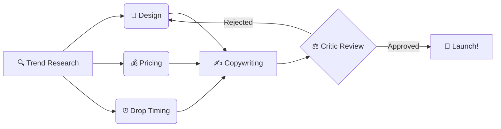

<div align="center">
  
  # ASBOS — Autonomous Sneaker Brand Operating System
  
  **Arétier (Ah-ray-tee-ay)**  
  *"The Maker of Excellence"*  
  <sub>Arete (ἀρετή) + -ier · Valour · Strength · Persistence</sub>

  <br />

  <p align="center">
    <a href="https://www.python.org/"></a>
    <a href="https://python.langchain.com/docs/langgraph/"></a>
    <a href="https://streamlit.io/"></a>
    <a href="https://deepmind.google/technologies/gemini/"></a>
    <a href="https://www.trychroma.com/"></a>
  </p>
</div>

---

## 🚀 Overview

ASBOS is a **stateful multi-agent LangGraph system** that autonomously operates a virtual sneaker brand across the entire product lifecycle. From trend research to adversarial critique, a team of specialized AI agents collaborate, debate, and design the next hype sneaker drop.



## ✨ Core Features

- **🧠 Multi-Agent Orchestration**: 6 distinct specialist agents (Research, Design, Pricing, Timing, Copy, Critic) managed via a LangGraph fan-out topology.
- **🛡️ Adversarial Evaluation**: An LLM-powered Critic evaluates the output against a deterministic rubric. If the approval score is `< 0.75`, the design is rejected and goes back to the drawing board (max 3 iterations).
- **🎨 Multimodal AI**: Leverages Google Gemini 1.5 Flash for reasoning/copywriting and Imagen 3 for sneaker design generation.
- **📊 RAG-Powered Decisions**: Uses local ChromaDB and `all-MiniLM-L6-v2` embeddings to retrieve historical market data, brand voice guidelines, and successful drop timings.
- **🖼️ Quantitative Aesthetics**: Uses local CLIP (`ViT-B/32`) to compute cosine similarity between the design brief and the generated image, ensuring strict visual alignment.

## 🤖 The Agent Team

| Agent | Role | Tech Stack |
| :--- | :--- | :--- |
| **🔍 Trend Research** | Scrapes Hypebeast & Reddit for aesthetic keywords | `feedparser`, `PRAW`, `ChromaDB RAG` |
| **🎨 Design** | Writes briefs, generates images, scores with CLIP | `Gemini Imagen`, `CLIP (local)` |
| **💰 Pricing** | Sets retail prices using historical resale comps | `ChromaDB market_data`, `StockX dataset` |
| **⏰ Drop Timer** | Determines optimal launch date/time | `ChromaDB drop_timing`, `CSV Analytics` |
| **✍️ Copywriter** | Drafts product descriptions & tweet copy | `Gemini`, `brand_voice RAG` |
| **⚖️ Critic** | Adversarial review to prevent sycophancy | `Deterministic rubric`, `LLM Analysis` |

## 🛠️ Architecture Stack (100% Free)

- **LLM & Image Gen**: Google Gemini 1.5 Flash + Imagen 3
- **Vector DB**: ChromaDB (Local, disk-persisted)
- **Embeddings**: all-MiniLM-L6-v2 (Runs locally on GPU/CPU)
- **Image Evaluation**: CLIP ViT-B/32 (Local, ~300MB VRAM footprint)
- **Orchestration & State**: LangGraph
- **Frontend**: Streamlit
- **Observability**: LangSmith

## ⚡ Quick Start

### 1. Clone & Install
```bash
git clone https://github.com/Chaloopanda/Aretier.git
cd Aretier
pip install -r requirements.txt
```

### 2. Configure Environment
```bash
cp .env.example .env
# Open .env and add your GEMINI_API_KEY
```

### 3. Initialize Vector Store (One-time)
```bash
python ingestion/build_vectorstore.py
```

### 4. Launch the App
```bash
streamlit run app/streamlit_app.py
```

## 🔑 Required API Keys (All Free Tier)

| Service | Link | Tier Benefits |
| :--- | :--- | :--- |
| **Gemini API** | [aistudio.google.com](https://aistudio.google.com) | 15 RPM, 1M TPM/day |
| **LangSmith** | [smith.langchain.com](https://smith.langchain.com) | Free tier observability |
| **Reddit API** | [reddit.com/prefs/apps](https://www.reddit.com/prefs/apps) | Free read access |

## 📈 Evaluation Metrics

To successfully pass the **Critic**, the product must meet these strict criteria (Composite Weighted Average ≥ 0.75):
- **Design (30%)**: CLIP cosine similarity `≥ 0.28` (ensures exact text-to-image alignment).
- **Pricing (25%)**: Retail price strictly between `$80 - $500` with a projected resale premium of `≥ 15%`.
- **Timing (20%)**: Drop date must be `≥ 7 days` out, ideally scheduled on a Thursday, Friday, or Saturday.
- **Copy (25%)**: Must be `100–200` words, avoid banned promotional openers, and omit explicit price mentions in the lore.

---

<p align="center">
  <i>Built for Agentic AI & LLM product roles — demonstrating production-grade multi-agent orchestration, deterministic self-evaluation, and complex state management.</i>
</p>
